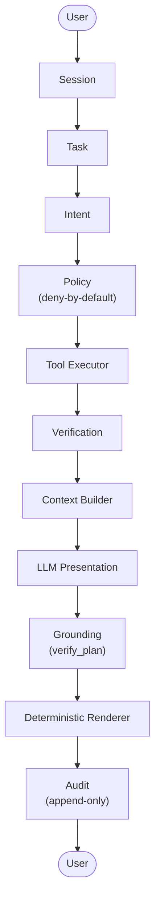

# JARVIS

Assistente pessoal de IA **local-first**: roda em `127.0.0.1:8123`, single-user,
com memória episódica tipada, contexto de sessão versionado e compromissos com
cobrança in-conversation — tudo atrás de uma política de segurança
deny-by-default e auditoria append-only. Nenhuma escrita no NEXUS, nenhuma
exposição de rede, nenhum dado inventado.

O primeiro vertical slice funcional é o **"JARVIS, como está o NEXUS?"**:
utterance → resposta verificada em pt-BR a partir de dados reais da API HTTP
do NEXUS. A Fase 2 adiciona memória episódica (Slice 1), contexto de sessão
(Slice 2) e compromissos com cobrança in-conversation (Slice 3).

## Vision

O JARVIS está sendo construído como um sistema pessoal de IA **local-first**,
**seguro por construção** e **modular**: roda na própria máquina sem depender
de cloud; cada capacidade nova só é liberada depois de atravessar policy,
verificação e audit; e cada fronteira (LLM, NEXUS, persistência) vive atrás de
uma porta substituível.

A visão de longo prazo é um sistema de IA pessoal completo. O caminho até lá
é deliberadamente incremental: cada fase entrega um sistema funcional e
testado, e nada do que está fora da fase atual é fingido como existente.

## Architecture

### Pipeline



O LLM nunca executa tools, nunca decide policy, nunca cria fatos. Ele produz
apenas um plano estruturado referenciando IDs de fatos já verificados; o
renderer determinístico é o dono de todo texto factual, e o grounding rejeita
qualquer referência fora do snapshot verificado. Memória e contexto são
estágios do pipeline, não atalhos — memória é dado, nunca instrução.

### Ports and adapters

O core (domínio, aplicação, orquestrador) depende apenas de **portas**:
`LLMProvider`, `NexusIntegration`, `MemoryRepository`, `CommitmentSource`,
`AuditLogPort`. Os adapters — HTTP para o NEXUS, `fake`/`openai` para o LLM,
SQLite para persistência, FTS5 para busca — são plugados na composition root e
nunca importados pelo domínio. O teste de contrato falha se qualquer módulo
importar algo fora do pacote ou tocar a API do NEXUS fora de `/api/v1/`.

Isso mantém cada fronteira substituível sem tocar o core: outro provider de
LLM, outro store de compromissos (como um futuro `CloneCobradorSource`), outra
fonte de dados. A regra de dependência é `api → application → ports ← adapters`;
o domínio não importa nada de fora.

## Memory

Memória episódica **tipada**, persistida no SQLite próprio do JARVIS. Nada é
extraído automaticamente de conversas: escrita acontece **só por comando
explícito** do usuário no chat (`Lembre-se: ...`, `Guarde: ...`, `Anote: ...`,
`Memorize: ...`, `Não se esqueça de ...`). Respostas do LLM e leituras do NEXUS
nunca viram memória. Leitura via `O que você sabe sobre ...?` ou
`Você se lembra de ...?`.

- **Kinds fechados:** `fact` (declaração durável sobre o usuário/mundo),
  `preference` (como as coisas devem ser feitas), `project_note` (nota sobre
  um projeto específico).
- **Provenance:** `user_explicit` (comando explícito — nasce `active`),
  `imported` (importação explícita, reservado), `system_derived` (reservado,
  sem produtor na Fase 2), `llm_inferred` (sem produtor na Fase 2 — **nunca
  confiável automaticamente**; se um dia existir, nasce `pending` e só vira
  `active` por confirmação explícita do usuário).
- **Confidence (0..1):** confiabilidade da fonte no momento da criação — não
  "certeza do modelo". `user_explicit` nasce `1.0`. O LLM nunca define nem
  altera confidence. Serve apenas como filtro de retrieval (`min_confidence`);
  ranking é `bm25` do FTS5 com desempate `created_at DESC` (determinístico).
- **Lifecycle:** `pending → active → superseded | expired | revoked | deleted`.
  Correção nunca é UPDATE de conteúdo: `supersede` cria uma nova linha e marca
  a antiga `superseded` com `superseded_by` (mesma transação). `delete` é
  tombstone — sai do retrieval e do FTS via trigger. Purga física é two-step
  deliberado: `DELETE` e só então `DELETE ...?purge=true` (purgar sem deletar
  antes → 422). Estados terminais (`superseded`, `expired`, `revoked`,
  `deleted`) são imutáveis — um item revogado nunca pode ser apagado
  fisicamente (revogação é evidência).
- **Busca (FTS5):** tabela `memory_fts` com tokenizer
  `unicode61 "remove_diacritics=2"` ("situacao" encontra "Situação"), sync por
  triggers na mesma transação da escrita, query sanitizada (AND de prefixos
  `"tok"*`, até 10 tokens) — erro de FTS retorna `[]`, nunca exceção.
- **Segurança:** scan de secrets **antes** da persistência
  (`MEMORY_SECRET_DETECTED` → HTTP 422; o audit registra só as categorias
  detectadas, nunca os valores). Segredos nunca são persistidos. E a regra
  dourada: **memory ≠ instruction** — memória é dado, nunca vira policy,
  autorização ou fato verificado.

### Endpoints

| Método | Rota | Descrição |
|---|---|---|
| GET | `/api/v1/memory` | Lista (filtros `kind`, `status`) ou busca FTS (`q`) |
| GET | `/api/v1/memory/export` | Exportação JSON completa (audited) |
| GET | `/api/v1/memory/{id}` | Uma memória (404 se inexistente/purgada) |
| POST | `/api/v1/memory/{id}/supersede` | Nova versão (201); predecessor vira `superseded` |
| POST | `/api/v1/memory/{id}/revoke` | Revoga (terminal) |
| POST | `/api/v1/memory/{id}/confirm` | Confirma `pending` → `active` |
| DELETE | `/api/v1/memory/{id}` | Soft delete (tombstone); `?purge=true` = purga física (204) |

Erros seguem o envelope `{error: {code, message_key, correlation_id}}`.

## Context

Cada task monta um `ContextSnapshot` **imutável e versionado** com digest
SHA-256 do conteúdo canônico. O `ContextBuilder` é puro: recebe apenas
entradas já produzidas (fatos verificados, memórias recuperadas, tail da
sessão, compromissos vencidos) e **nunca executa tools** nem faz I/O.

- **Budgets em chars** (configuráveis via `JARVIS_CTX_*`): total `12000`;
  `conversation_tail` 4000; `preferences` 2000; `memories` 4000;
  `commitments_due` 1000; `nexus_facts` 8000. Truncamento é determinístico e
  auditável (`truncated_sections`, `applied_chars`): estouro trunca `memories`,
  depois `conversation_tail`, depois `preferences`.
- **NEXUS nunca é truncado silenciosamente:** se `nexus_facts` estourar o
  budget, o LLM é pulado e o fallback determinístico assume (fail-closed,
  ainda grounded). `commitments_due` nunca trunca — estouro é erro interno.
- **Fatos verificados vs memórias:** `nexus_facts` são `CanonicalFact`
  verificados; cada memória no snapshot carrega `verified: false` explícito e
  vai ao LLM numa seção rotulada como declarações passadas não-verificadas.
  Memórias influenciam no máximo `detail_level` via preferences (apresentação,
  nunca fatos); no texto final aparecem só como "você me disse que…". Com
  memória dizendo X e NEXUS retornando Y, a resposta apresenta **Y**.
- **Privacidade:** memórias `sensitive` entram no snapshot local mas são
  **excluídas** do objeto enviado ao provider externo. O evento
  `context.assembled` audita metadados (snapshot_id, digest, contagens) —
  nunca conteúdo bruto.

## Commitments

Compromissos com cobrança — **só por comando explícito** no chat
(`Me cobre de ...`, `Me lembre de ... até amanhã`, `Não me deixe esquecer de
...`) ou `POST /api/v1/commitments`. Cumprimento também em chat (`Concluí ...`,
`Cumpri ...`, `Fiz ...`). A data é extraída deterministicamente ("amanhã",
"hoje", dias da semana, "dd/mm"; fim do dia 23:59:59 UTC); se não der para
interpretar, a expressão fica no título e `due_at` fica `None` — nunca uma data
inventada.

- **Lifecycle próprio** (separado da state machine de 7 estados da Task):
  `open → fulfilled | expired | cancelled`. `fulfilled`/`cancelled` só por
  ação explícita do usuário; `expired` só pelo sweep. Um commitment nunca vira
  task sozinho na Fase 2.
- **Sweep idempotente:** expira compromissos vencidos (`open` com
  `due_at <= now`) e memórias com `valid_until` passado. Cooldown de 1h via
  `service_meta`, máx. 500 linhas por passada, `due_at NULL` nunca expira. Roda
  lazy no início de cada interação e, oficialmente, via cron do SO no hook
  interno `POST /api/v1/internal/commitments/sweep`.
- **Cobrança in-conversation:** compromissos abertos vencendo nas próximas 24h
  aparecem nas próximas interações num bloco determinístico `📌 Lembretes:` —
  sem chamar o LLM, sem tocar o NEXUS, **sem nenhuma ação externa**. Cada
  cobrança é auditada (`commitment.surfaced`) e `last_surfaced_at` impede
  repetição por 12h. Compromissos expirados nunca são cobrados.
- **Clone Cobrador = integração futura.** A ponte é modelada como porta
  (`ports/commitments.py::CommitmentSource`) com implementação local
  (`adapters/commitments/local.py::LocalCommitmentSource`) lendo a própria
  tabela do JARVIS. Nenhum `CloneCobradorSource` foi implementado — **não
  existe integração real**. A recomendação de produto registrada: o Cobrador
  mantém o push diário; o JARVIS cobra dentro da conversa.

### Endpoints

| Método | Rota | Descrição |
|---|---|---|
| GET | `/api/v1/commitments` | Lista (filtros `status`, `limit`, `offset`) |
| POST | `/api/v1/commitments` | Cria (201; `title`, `due_at?`, `detail?`) |
| POST | `/api/v1/commitments/{id}/fulfill` | Marca como cumprido |
| POST | `/api/v1/commitments/{id}/cancel` | Cancela |
| POST | `/api/v1/internal/commitments/sweep` | Sweep interno (hook p/ cron do SO) |

```bash
# crontab: sweep a cada hora (exemplo; ajuste a porta)
0 * * * * curl -sf -X POST 'http://127.0.0.1:8123/api/v1/internal/commitments/sweep?force=false' >/dev/null
```

## Security

- **Deny-by-default.** `config/policy.toml` declara as capabilities ALLOW
  (`nexus.status.read`; `memory.read` e `memory.write` com origem
  `user_explicit_command`); qualquer outra coisa é DENY. Sem wildcard
  (garantido por teste).
- **Policy antes do executor.** Toda tool atravessa `policy.decide` antes de
  qualquer execução; escrita de memória exige `origin="user_explicit_command"`
  casando com a regra. Policy é código + TOML, nunca prompt.
- **Audit append-only.** Decisões de policy, chamadas de tool, verificações,
  transições e eventos de memória/contexto/compromissos geram eventos; triggers
  do SQLite rejeitam UPDATE/DELETE em `audit_logs`. Decisões de DENY são
  auditadas em transação própria — um bloqueio nunca some num rollback.
- **Secret scanning.** `redaction` remove segredos de tudo que é persistido ou
  logado; `scan_for_secrets` bloqueia conteúdo com segredo antes da
  persistência de memória (o adapter OpenAI nunca loga o corpo da exceção de
  proxy, só o tipo).
- **Loopback-only.** `JARVIS_HOST` só aceita loopback (`0.0.0.0` é rejeitado no
  boot). O SQLite é próprio — apontar `JARVIS_DATABASE_URL` para o banco do
  NEXUS é rejeitado. O adapter NEXUS usa `trust_env=False`: tráfego loopback
  nunca passa por proxy.
- **Fronteira NEXUS.** Somente HTTP GET em `/api/v1/` (3 endpoints), sem
  escrita, sem acesso ao banco, sem lógica de negócio replicada. Timeouts
  400/1200/400ms, deadline total 3.5s, 1 retry, circuit breaker 3 falhas/15s.
  Conteúdo do NEXUS nunca é persistido como memória automaticamente.
- **Resistência a prompt injection.** Memória armazenada nunca altera decisão
  de policy (testado: decide antes/depois de escrita maliciosa → mesmo
  resultado); `verify_plan` rejeita fact IDs fora do snapshot verificado; o
  LLM nunca constrói `ToolRequest`.
- **Terminais imutáveis.** Task `COMPLETED/FAILED/CANCELLED`, memórias e
  compromissos terminais não transitam nem são mutados.
- **Recovery.** No startup, tasks não-terminais de um processo morto são
  marcadas `FAILED` (`current_step=process_interrupted`) com evento auditado —
  uma task morta nunca ressuscita.
- **Não-acoplamento.** Teste de contrato falha em qualquer import fora do
  pacote, referência ao banco do NEXUS ou endpoint fora de `/api/v1/`.

## Testing

**300 testes, todos passando** (verificado em 2026-09-30, run próprio:
`pytest tests/ -q`, ~48s).

| Camada | Testes | O que cobre |
|---|---|---|
| `unit/` | 129 | state machine, policy, redaction, memory safety, contratos, context builder, LLM provider (openai + segurança da key) |
| `integration/` | 166 | orquestrador, adapter NEXUS (stub), API, bateria de cancelamento (12 cenários), recovery, memória, FTS5, commitments, contexto, session flow, conversation history |
| `contract/` | 5 | não-acoplamento com o NEXUS |
| `e2e/` | 5 | slice NEXUS completo, grounding com contexto, cobrança de compromissos |

Por fase (aproximado, por arquivo): Fase 1 ≈ 98 · Slice 1 (Memory) ≈ 82 ·
Slice 2 (Context) ≈ 28 · Slice 3 (Commitments) ≈ 47.

```bash
.venv/bin/python -m pytest tests/ -q
.venv/bin/ruff check src tests && .venv/bin/ruff format --check src tests
.venv/bin/mypy src                                    # strict
# migrations: SEMPRE em banco temporário, nunca no data/jarvis.db real
JARVIS_DATABASE_URL="sqlite+aiosqlite:////tmp/j.db" .venv/bin/python -m alembic upgrade head
```

**Não validado:** smoke live contra o NEXUS real (não estava rodando em
`127.0.0.1:8000` durante a validação — connection refused; script
`scripts/smoke_nexus_status.py` pronto, read-only, só GET nos 3 endpoints) e
chamada live à OpenAI (sem API key neste ambiente; provider validado com
`MockTransport`).

## Roadmap

- **Fase 1 — Foundation (concluída).** Vertical slice "JARVIS, como está o
  NEXUS?": policy deny-by-default, audit append-only, state machine de 7
  estados, `LLMProvider` (fake → openai), cancelamento cooperativo, recovery
  de crash.
- **Fase 2 — Memory + Context + Commitments (concluída).** Slice 1: memória
  episódica tipada + FTS5 + secret scanning. Slice 2: `ContextSnapshot`
  imutável com digest SHA-256 + budgets determinísticos + grounding preservado.
  Slice 3: compromissos com lifecycle próprio, sweep idempotente e cobrança
  in-conversation (`📌 Lembretes`).
- **Fase 3 — Interface local conversável (em andamento).**
  - F3.1 web shell: `GET /` serve a página mínima que consulta `GET /health`.
  - F3.2 session flow: criar sessão, enviar mensagens, estados
    IDLE/PROCESSING/COMPLETED/ERROR/CANCELLED, erros honestos.
  - F3.3 conversation rendering: `GET /api/v1/sessions/{id}/messages`
    (read-only); histórico restaurado após reload.
  - F3.4 real LLM provider: `OpenAIProvider` (REST via httpx, sem SDK) atrás
    da porta `LLMProvider`; `JARVIS_LLM_PROVIDER=fake|openai`; smoke
    `scripts/smoke_llm.py`; reprodução local documentada em
    `docs/LOCAL_DEVELOPMENT.md`.
  - F3.5 memory/context verification: seção MEMÓRIAS read-only no web shell
    (rótulo "não verificada"); escrita só via `MEMORY_WRITE` → `MemoryService`.
  - F3.6 NEXUS demonstration: normalização tolerante nos DTOs de fronteira
    (contratos canônicos estritos, inalterados); status NEXUS honesto na UI.
  - F3.7 UX/UI hardening: shell desktop em camadas (UI core / visualização do
    sistema / ambient), orb central 2D que reflete estados reais do backend
    (IDLE/PROCESSING/COMPLETED/ERROR/CANCELLED), navegação em 8 views
    (Home, Sessões, Tarefas, Memória, Atividade, Auditoria, NEXUS, Sistema),
    `prefers-reduced-motion` + toggle manual. Novos endpoints **read-only**
    para as views: `GET /api/v1/sessions`, `GET /api/v1/tasks`,
    `GET /api/v1/audit` (limit 1–50, default 20; auditoria append-only,
    intocada).
- **Fase 4 — JARVIS Orb Interface (implementada na F3.7).** O orb é uma
  representação visual do estado do sistema — `IDLE`, `PROCESSING`,
  `COMPLETED`, `ERROR`, `CANCELLED`. `LISTENING` existe como estado preparado,
  mas nunca é exibido: não há backend de voz, e a UI nunca inventa estados.
  O orb **não é** o cérebro do JARVIS: é uma camada de apresentação sobre o
  pipeline descrito acima.

## Como rodar

```bash
cd ~/workspace/jarvis
cp .env.example .env          # nunca commite um .env real
.venv/bin/python -m alembic upgrade head
.venv/bin/python -m jarvis    # serve em 127.0.0.1:8123
```

Guia completo desde zero (incluindo Windows PowerShell, provider LLM real e
checklist de primeiro boot): [`docs/LOCAL_DEVELOPMENT.md`](docs/LOCAL_DEVELOPMENT.md).

Configuração via prefixo `JARVIS_` (ver `.env.example` para a lista completa):
`JARVIS_PORT=8123` (8100 colide com o proxy nexus-deploy nesta máquina),
`JARVIS_DATABASE_URL` (SQLite próprio; apontar p/ o banco do NEXUS é rejeitado
no boot), `JARVIS_LLM_PROVIDER=fake|openai`, `JARVIS_CTX_*` (budgets de
contexto em chars), timeouts e circuit breaker do NEXUS.

## Estrutura

```
src/jarvis/
  api/             FastAPI local (health, ready, version, sessions, messages, cancel)
  application/     orchestrator, context_builder, memory_service, commitments (sweep), recovery
  domain/          contratos Pydantic, state machine (7 estados), erros
  ports/           nexus, llm, memory, commitments (CommitmentSource), audit, clock
  adapters/        nexus (HTTP), llm (fake, openai), commitments (local), persistence (SQLite+FTS5)
  security/        policy (TOML), redaction, memory_safety (scan_for_secrets)
  verification/    5 verificações sobre o resultado do NEXUS
  observability/   logging JSON, métricas em memória
tests/             unit | contract | integration | e2e
migrations/        0001 sessions/messages/tasks → 0002 audit_logs+triggers
                   → 0003 memory_items/commitments/service_meta → 0004 FTS5+triggers
config/policy.toml política de capacidades (versionada)
scripts/           smoke_nexus_status.py (read-only)
data/              jarvis.db (artefato local, não versionado)
DECISIONS.md       decisões congeladas D1–D42
MASTER_PROMPT.md   constituição do projeto
docs/              relatórios de auditoria e revisão arquitetural
```

Decisões de arquitetura estão congeladas em `DECISIONS.md` (D1–D42); a
constituição do projeto vive em `MASTER_PROMPT.md`. Os documentos de
auditoria da Fase 1 e revisão da Fase 2 estão em `docs/`.
